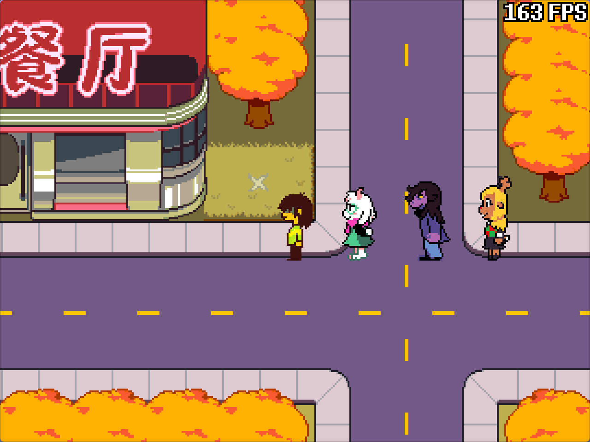
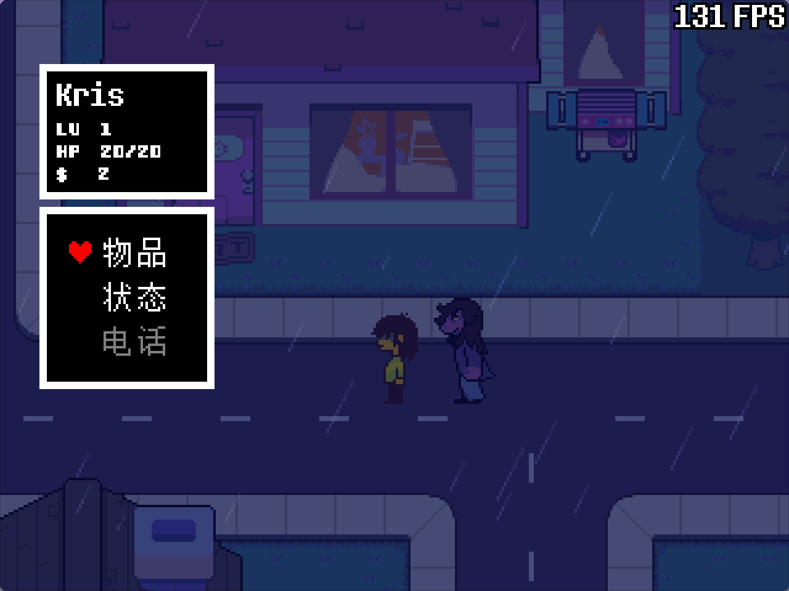
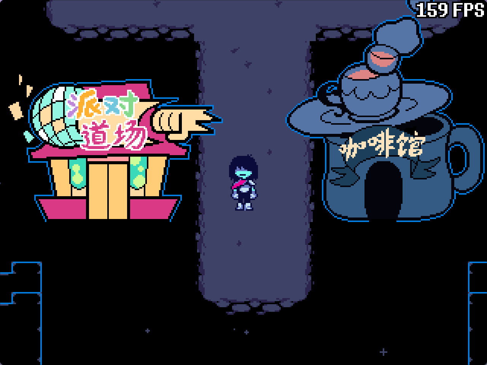
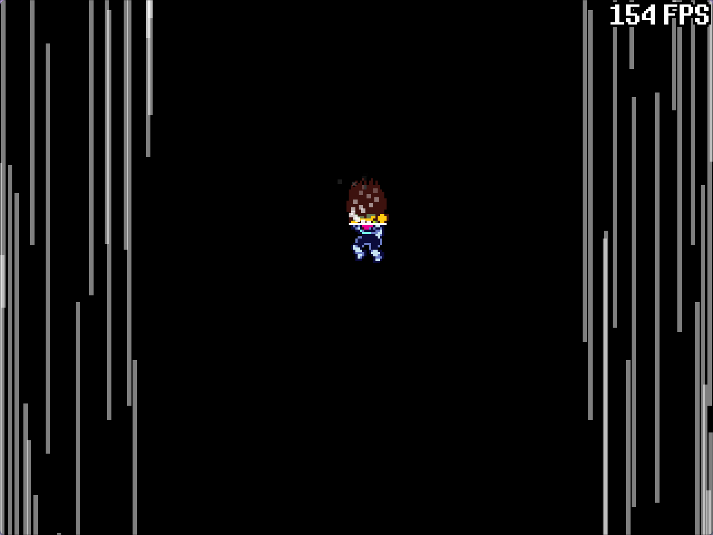
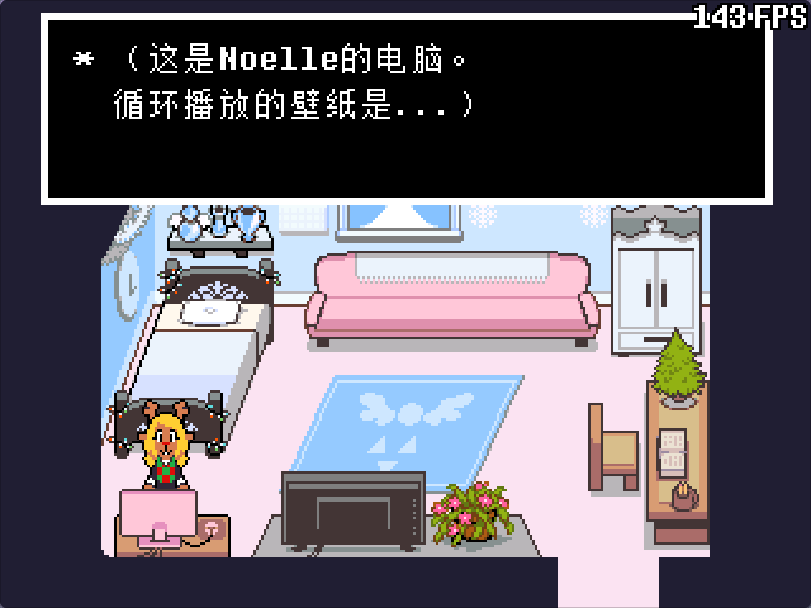

# Hometown Mod (i18n)

[](LICENSE)
<br>




<details>
<summary>More screenshots (night walk in the rain / castletown / transformation / Noelle's house)</summary>









</details>

**Hometown Mod (i18n)** — a Simplified Chinese localization fork of the Hometown
(light world) mod, bundling the [kristal-i18n](https://github.com/Bli-AIk/kristal-i18n)
multilingual localization library.

| English | 简体中文                |
| ------- | ----------------------- |
| English | [简体中文](./README.md) |

## What is this

A Simplified Chinese localization fork of the Hometown Mod subtree in AfterChill's
[`sekalisukarumah-boop/deltarune-AC`](https://github.com/sekalisukarumah-boop/deltarune-AC)
(BSD-3-Clause):

- The complete Hometown light world (torielhouse / town / school / hospital / library / convenience store…) plus the dark world castle area (`dark/castletown/...`)
- Bundles **kristal-i18n** (MIT/Apache-2.0, [Bli-AIk/kristal-i18n](https://github.com/Bli-AIk/kristal-i18n)) — a localization library for Kristal, with in-game switching between `en` / `zh_hans`
- Asset usage matches the kristal-i18n README (translation source: [Goodman 3 Localization Group](https://github.com/gm3dr/DeltaruneChinese) gm3dr/DeltaruneChinese workspace)

## Localization coverage

| Content                 | Count      | Notes                                                                                          |
| ----------------------- | ---------- | ---------------------------------------------------------------------------------------------- |
| Dialogue/item/UI strings | **550**    | `lang/zh_hans.json`, keys are the original runtime text; ≤19 chars per line per Goodman group standard |
| Character names         | **24**     | `lang/names.json`, incl. full names (Rudy "Rudolph" Holiday, Asgore Dreemurr, Noelle…), referenced via `[name:xxx]` |
| Map texture variants    | **20**     | `assets/sprites/lang/zh_hans/`, Chinese signage/building textures (sansstore, hospital, school, Librarby, Ice-E's Pizza…) |
| sans Chinese font       | 1 set      | FangZheng Kaitong Simplified (27/24), used for sans's dialogue only                             |

**Mechanics** (kristal-i18n):

- **Source-text lookup**: under `zh_hans`, display paths such as `DialogueText`/`TextChoicebox`/`SpeechBubble` are looked up from original text to translation — dialogue, shop and battle text is translated automatically with zero script changes
- **CJK line-break safety net**: overlong lines are auto-broken at punctuation (fallback for uncovered text)
- **Name references**: `[name:kris]` etc. resolved via names.json; `defaultNameLanguage` can show Chinese or English names independently
- **Texture/font language variants**: `lang/zh_hans/<id>` convention, applied immediately on language switch
- **Language switching**: in-game settings menu or F7 (`Game:setLanguage("zh_hans")`)

## Installation

Drop the whole directory into Kristal's `mods/` folder (or package it as a mod ZIP):

```bash
git clone --recurse-submodules git@github.com:Bli-AIk/hometown-mod-i18n.git
cp -r hometown-mod-i18n /path/to/kristal/mods/hometown-mod-i18n
```

## Development

Requires Git, LÖVE 11.5, `just`, LuaJIT.

```bash
just run             # run against a local Kristal checkout (supports --encounter / --wave debug args)
just test            # make test: static assertions + luajit syntax check + debug tools dry-run
```

## Setting the hometown map's weather and time

### Time (day/night)

flag `hometown_time`, values `day` / `sunset` / `night` / `sunrise`:

```lua
Game:setFlag("hometown_time", "night")     -- night: night palette + dark overlay + night objects
Game:setFlag("hometown_time", "sunset")    -- sunset
Game:setFlag("hometown_time", "day")       -- day
```

- Controller `scripts/world/controllers/hometowndaynight.lua`: applies `BGPaletteFX`
  palettes based on the flag, the night dark overlay (`HometownNightOverlay`), and
  shows/hides objects per `day_mode`/`night_mode`
- Map object properties `day` / `night` / `sunset` / `sunrise` / `rain` (`true`/`false`):
  the object only appears in the matching time/weather (handled by `Mod:loadObject`)
- Music switches with time of day (`Mod:onMapMusic`: town_day / town / forecasted_hometown_night…)

### Weather (weatherlib)

Depends on [MrFukuo/WeatherLib](https://github.com/MrFukuo/WeatherLib) (submodule):

```lua
Game.stage:setWeather("rain")      -- rain
Game.stage:hasWeather("rain")      -- check current weather
Game.stage:setWeather()            -- clear (sunny)
```

- Weather types: `rain` / `heavy_rain` / `thunder` / `snow` / `leaf` / `dust` / `fog` / `flipped_rain` / `volcanic` / `hot`
- Systems integrated with weather: `beachwater` (water rises while raining), `leaves`
  border (rain overlay), `Interactable` (`rain_text` rain-only interact text),
  `town_mid` object visibility conditions
- Advanced: `setWeatherParent` / `setWeatherLayer` / `resetWeather` / `WeatherRegistry`

## Upstream sources and references

This mod's content, translations and dependency libraries are not original. Sources and
references are listed below (attribution format follows the
[kristal-i18n](https://github.com/Bli-AIk/kristal-i18n) README):

| Project | Author/Organization |
|---------|---------------------|
| [deltarune-AC](https://github.com/sekalisukarumah-boop/deltarune-AC) (Hometown Mod subtree, BSD-3-Clause) | [sekalisukarumah-boop](https://github.com/sekalisukarumah-boop) |
| [DeltaruneChinese](https://github.com/gm3dr/DeltaruneChinese) (translation source) | [Goodman 3 Localization Group \| UNDERTALE & DELTARUNE Chinese Localization](https://github.com/gm3dr/) |
| [kristal-i18n](https://github.com/Bli-AIk/kristal-i18n) (bundled localization library, MIT/Apache-2.0) | [Bli-AIk](https://github.com/Bli-AIk) |
| [WeatherLib](https://github.com/MrFukuo/WeatherLib) (weather system) | [MrFukuo](https://github.com/MrFukuo) (crocokuo) |
| [thrash-machine](https://github.com/Bli-AIk/thrash-machine) (dev toolchain) | [Bli-AIk](https://github.com/Bli-AIk) |

## License

- Upstream content per `LICENSE` (BSD-3-Clause, Copyright (c) 2021 SylviBlossom)
- kristal-i18n: MIT/Apache-2.0 ([Bli-AIk/kristal-i18n](https://github.com/Bli-AIk/kristal-i18n))
- Attribution and license boundaries for each library: see [`THIRD_PARTY.md`](THIRD_PARTY.md)
- DELTARUNE is copyrighted by Toby Fox; this project is a fan remake and is not affiliated with Toby Fox
